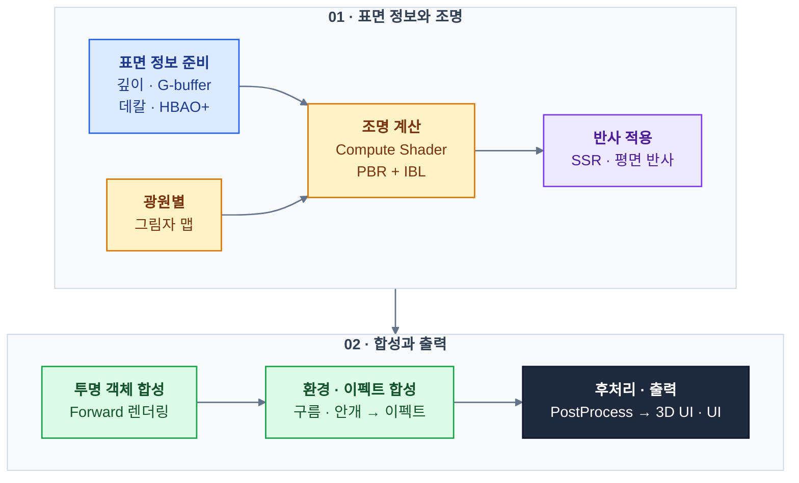
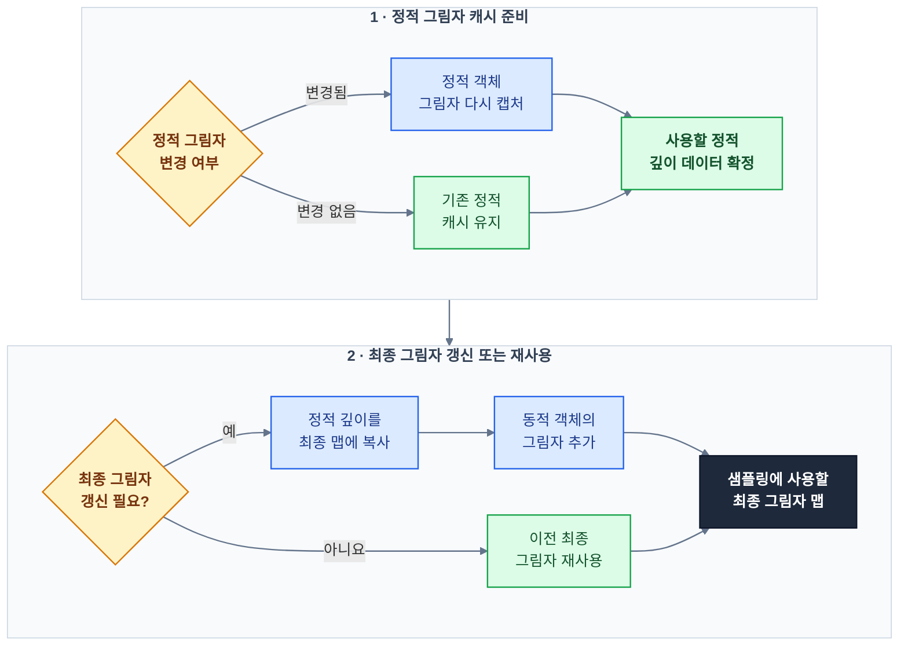
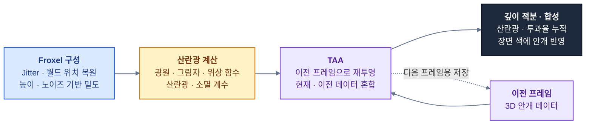
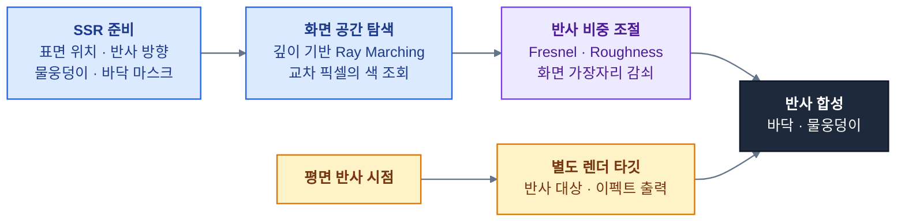
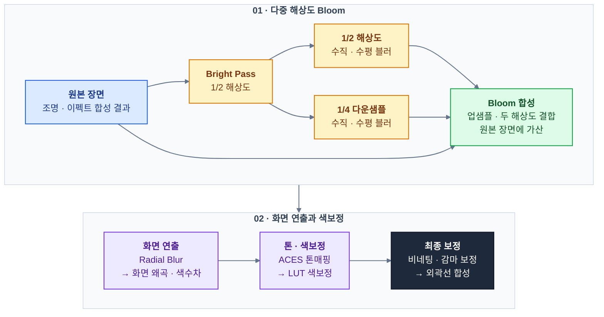

# Hogwarts Legacy 모작 — C++ · DirectX 11 팀 프로젝트

오픈월드 액션 RPG **Hogwarts Legacy · 호그와트 레거시**를 **C++와 DirectX 11 자체 엔진으로 모작한 7인 팀 프로젝트**입니다.
호그와트·호그스미드 탐험, 주문 전투, 보스전과 빗자루 비행 콘텐츠를 제작했으며, **셰이더·렌더링을 주로 담당**했습니다. **Deferred PBR**을 중심으로 **다중 광원·그림자**, **볼류메트릭 안개·구름**, **SSR · PostProcess**를 구현하고 **레벨의 조명·재질·분위기**를 조정했습니다.
### [GitHub Repository](https://github.com/Nu-LungJi/Direct3D-Team_Project)
### [게임 시연 영상](https://www.youtube.com/watch?v=pH1RYggPNs4)

| 항목        | 내용                                                                                        |
| --------- | ----------------------------------------------------------------------------------------- |
| 개발 기간     | 2026.06.30 ~ 2026.08.30 (약 8주)                                                            |
| 개발 인원     | 7인 — 셰이더·렌더링 중심 담당                                                                        |
| 플랫폼       | Windows PC / x64                                                                          |
| 장르·플레이 구성 | 3인칭 액션 RPG · 월드 탐험 · 주문 전투 · 보스전 · 빗자루 비행                                                 |
| 프로젝트 구성   | 공통 Engine · 게임 Client · MapEditor · SampleClient · 모델 변환 도구                               |
| 주요 담당     | 렌더링 파이프라인, PBR·환경광, 다중 광원·그림자, 볼류메트릭, 반사·후처리·최적화                                          |
| 추가 담당     | 이펙트 제작·연동, 맵 재질 편집·저장, Scatter 확장, 레벨 조명·환경 배치, 팀 코드 통합                                   |
| 사용 기술     | C++20 · Direct3D 11 · HLSL · Compute Shader · NVIDIA HBAO+ · Dear ImGui                   |
| 제작 보조     | Git/GitHub(협업), RenderDoc(디버깅), Tracy Profiler(디버깅), Google Gemini(AI), ChatGPT Codex(AI) |

## 주요 기술 구현

| 번호     | 기술                         | 핵심 구현                                                          |
| ------ | -------------------------- | -------------------------------------------------------------- |
| **1**  | **Deferred PBR 렌더링 파이프라인** | MRT 기반 G-buffer, 깊이 기반 위치 복원, Compute Shader 조명·투명 객체 합성       |
| **2**  | **PBR 재질·IBL 환경광**         | Metallic/Roughness, GGX·Smith·Schlick, Cubemap·BRDF LUT 기반 환경광 |
| **3**  | **다중 광원·CSM·그림자 최적화**      | 방향광·점광원·스포트라이트, 4분할 CSM, PCF, 광원 컬링·정적 그림자 캐시                  |
| **4**  | **Volumetric Fog·God Ray** | Froxel 격자, 광원·그림자 기반 산란, 깊이 방향 적분·시간적 누적                       |
| **5**  | **Volumetric Cloud**       | Ray Marching, Noise·Weather Map, 광원 방향 샘플링·Early Out           |
| **6**  | **SSR·평면 반사**              | 화면 깊이 기반 반사 탐색, 물웅덩이 마스크, 별도 반사 시점의 결과 합성                      |
| **7**  | **HBAO+·PostProcess**      | AO 연동, 다중 해상도 Bloom, Radial Blur·ACES·LUT·외곽선                  |
| **8**  | **이펙트 제작·연동**              | Dissolve 발광 경계, 번개 UV 왜곡·페이드, StarBurst·보스 이펙트 연동              |
| **9**  | **맵 재질 편집·Scatter 확장**     | 재질 파라미터 저장·복원, 지형 노멀 정렬·무작위 회전 배치                              |
| **10** | **레벨 조명·환경 제작·통합**         | 레벨 조명·안개·재질 조정, 맵 이펙트 배치, 렌더링 경로·바인딩 정리                        |

아래는 **개인 담당 구현을 중심으로 정리한 내용**입니다. 맵 에디터와 파티클 시스템은 팀의 기존 기반을 확장·연동했으며, HBAO+는 NVIDIA SDK를 렌더링 파이프라인에 통합했습니다. 

### 1. Deferred PBR 렌더링 파이프라인

불투명 객체의 **재질 정보 출력과 조명 계산을 분리**했습니다. 하나의 픽셀 셰이더에서 여러 렌더 타깃에 정보를 기록한 뒤, Compute Shader가 G-buffer와 광원 데이터를 읽어 최종 조명을 계산합니다.

| G-buffer     | 저장 정보                     | 활용                  |
| ------------ | ------------------------- | ------------------- |
| **Diffuse**  | 재질 기본 색상                  | PBR의 Albedo         |
| **Normal**   | 인코딩된 월드 노멀                | 조명·AO·반사 방향 계산      |
| **SMRO**     | Metallic · Roughness · AO | 재질 반사 특성과 환경광 차폐    |
| **Emissive** | 자체 발광 색상                  | 조명 결과에 합산·Bloom 입력  |
| **Depth**    | 카메라 기준 픽셀 깊이              | 역투영을 통한 위치 복원·가림 판정 |

**불투명 객체는 Deferred로 처리하고, 투명 객체는 별도 Forward** 경로에서 그려 **조명 결과와 합성**합니다. 이후 **볼류메트릭·이펙트·후처리·UI 순서로 화면을 구성**합니다.

관련 코드: `Engine/Private/Renderer.cpp` · `Engine/ShaderFiles/PBR/CS_PBR.hlsl`

### 2. 물리 기반 재질과 이미지 기반 환경광

**Metallic/Roughness 방식의 PBR**을 적용했습니다. 표면 방향·시선·광원 방향과 재질 값을 조합해 확산광과 정반사광을 계산합니다.

- **GGX 분포:** 거칠기에 따른 미세면의 정반사 분포를 계산합니다.
- **Smith Joint GGX:** 미세면 사이의 가림에 따른 가시성 항을 계산합니다.
- **Schlick Fresnel:** 시선 각도에 따라 반사율을 변화시킵니다.
- **Metallic:** 기본 반사율과 확산 성분의 비중을 조절합니다.
- **IBL:** Irradiance Cubemap으로 확산 환경광을 구하고, Roughness에 대응하는 Prefiltered Cubemap mip과 BRDF LUT로 정반사 환경광을 구합니다.

재질 AO와 HBAO+ 결과를 환경광에 반영하고, 직접광·환경광·보조광의 밝기를 별도로 조절해 레벨별 색감과 어두운 면의 가독성을 맞췄습니다.

관련 코드: `Engine/ShaderFiles/PBR/CS_PBR.hlsl` · `Engine/ShaderFiles/ShaderHeader/SH_CommonFunction.hlsli`

### 3. 다중 광원·CSM·그림자 최적화

광원 종류에 맞는 그림자 맵을 구성하고, 광원 수와 그림자 갱신 비용을 관리했습니다.

| 광원 | 그림자 방식 | 구현 내용 |
| --- | --- | --- |
| **Directional** | 4분할 CSM | 카메라 절두체를 로그·선형 혼합 방식으로 분할하고 구간별 직교 투영 구성 |
| **Point** | Cube Shadow Map | 광원 위치에서 6방향 깊이를 저장하고 광원과 표면 사이의 거리로 비교 |
| **Spot** | 2D Shadow Map | 광원 시점으로 투영한 좌표와 저장된 깊이를 비교 |

그림자 경계에는 **Poisson Disk 샘플·회전 노이즈 기반 PCF**를 적용했습니다. 초기 샘플이 모두 밝거나 모두 어두운 경우 추가 샘플을 생략하고, CSM의 구간에 따라 샘플 수를 조절합니다.

점광원·스포트라이트의 그림자는 **정적 객체와 동적 객체를 분리**했습니다. 정적 장면이 바뀌었을 때 정적 그림자를 갱신하고, 최종 그림자 맵에 정적 결과를 복사한 뒤 동적 객체를 추가합니다.

이미 활성화된 광원과 그림자 슬롯에 유지 가중치를 부여해 카메라 이동 중 슬롯이 빈번하게 교체되는 것을 줄였습니다. 이펙트용 광원은 **풀에서 재사용**하고, 이펙트 위치와 수명에 맞춰 갱신·반환하도록 연결했습니다.

관련 코드: `Engine/Private/Light.cpp` · `Engine/Private/LightManager.cpp` · `Engine/ShaderFiles/PBR/CS_PBR.hlsl`

### 4. Froxel 기반 Volumetric Fog와 God Ray

카메라 시야 공간을 **3D Froxel 격자**로 나누고, 각 셀에 산란광과 소멸 계수를 저장했습니다. 높이에 따른 밀도 감소와 이동하는 3D 노이즈를 조합해 안개의 분포와 흐름을 표현합니다.

- **광원·그림자 연동:** 방향광의 CSM과 Point·Spot 그림자를 샘플링해 빛이 차단되는 구간을 산란광에 반영합니다.
- **방향성 산란:** Henyey–Greenstein 위상 함수로 시선과 빛의 방향에 따른 산란 강도를 조절합니다.
- **깊이 방향 적분:** 셀 구간의 길이와 소멸 계수로 투과율을 계산하고 산란광을 앞에서 뒤로 누적합니다.
- **TAA :**  Halton Jitter와 이전 프레임의 ViewProjection을 사용해 안개 데이터를 재투영·혼합합니다.

광원과 그림자에 따른 산란의 차이로 **God Ray**를 표현했습니다. 이 시간적 누적은 **볼류메트릭 안개에 적용한 처리**입니다. 안개 자체의 샘플링 계단 현상을 완화하고, 레벨별 밀도·높이·색상·광원 산란 강도를 조정할 수 있도록 구성했습니다.

관련 코드: `Engine/ShaderFiles/RayMarching/CS_Volumetric.hlsl` · `PS_Volumetric.hlsl`

### 5. Ray Marching 기반 Volumetric Cloud

카메라 광선과 구형 구름층의 교차 구간을 구한 뒤, 그 구간을 따라 밀도와 빛의 투과율을 누적했습니다.

| 구성 | 역할 |
| --- | --- |
| **Perlin–Worley 기반 볼륨 텍스처** | 큰 구름 덩어리의 기본 형태 |
| **디테일 Worley·Curl Noise** | 가장자리 침식과 좌표 왜곡 |
| **Weather Map·높이 분포** | 구름의 분포·덮임·수직 형태 제어 |
| **바람 오프셋** | 시간에 따른 구름 이동 |
| **광원 방향 추가 샘플링** | 구름 내부의 빛 감쇠와 음영 |
| **다중 산란 근사·Powder 효과** | 구름의 밝기와 두께감 표현 |

거리별 샘플 수 조절과 Blue Noise Jitter를 사용하며, 투과율이 충분히 낮아지면 탐색을 조기 종료합니다. 최종 구름 필터는 하늘과 장면 경계를 구분해 이웃 픽셀을 혼합합니다.

관련 코드: `Engine/ShaderFiles/RayMarching/CS_VolumetricCloud.hlsl`

### 6. 물웅덩이·바닥의 SSR과 평면 반사

**Screen Space Reflection**으로 화면에 보이는 물체의 반사를 계산했습니다. 깊이에서 표면 위치를 복원하고, 시선과 노멀로 구한 반사 방향을 따라 광선을 진행시킵니다. 광선의 위치와 화면 깊이가 일치하는 구간을 찾으면 해당 화면의 색상을 반사색으로 사용합니다.

물웅덩이 데칼과 바닥 마스크로 반사 영역을 지정하고, Fresnel·Roughness·화면 가장자리 감쇠로 반사 비중을 조절합니다. 물웅덩이의 재질 정보에는 거칠기·반영 비중과 **Octahedral 방식으로 압축한 노멀**을 저장해 조명 계산에 사용합니다.

별도 **평면 반사 시점에서 반사 대상과 이펙트를 렌더 타깃에 출력**하고, 바닥에 투영해 SSR 결과와 함께 합성합니다.

관련 코드: `Engine/ShaderFiles/Decal/CS_SSR.hlsl` · `Client/ShaderFiles/Decal/Shader_HogsmeadePuddle.hlsl`

### 7. HBAO+·PostProcess — Bloom과 화면 후처리

HBAO+에는 **깊이·월드 노멀·카메라 행렬·장면 스케일**을 전달하고, 결과를 PBR 환경광의 차폐에 반영했습니다.

Bloom은 밝은 영역을 추출한 뒤 가로·세로 각각 **1/2, 1/4 해상도**의 버퍼에서 수직·수평 블러를 수행합니다. 두 해상도의 결과를 업샘플링해 합성하고, 원본 장면에 더해 빛 번짐을 표현합니다.

| 후처리 | 구현 내용 |
| --- | --- |
| **Lens Flare** | 화면 공간에서 링 형태와 색 분리 마스크를 구성해 광학 연출 합성 |
| **Radial Blur** | 화면 중심 방향으로 여러 번 샘플링해 속도감·충격 연출 |
| **ACES 톤매핑·LUT** | HDR 조명 결과의 명암 압축과 레벨 색감 조정 |
| **색수차·비네팅·왜곡** | 화면 가장자리의 색 분리·명도 변화·UV 변형 |
| **선택 대상 외곽선** | 대상의 별도 깊이와 주변 픽셀의 차이를 검사하고 장면 깊이와 비교해 합성 |

관련 코드: `Engine/Private/Renderer.cpp` · `Engine/Private/MyGFSDK_SSAO.cpp` · `Engine/ShaderFiles/PostProcess/CS_PostProcess.hlsl`

### 8. Dissolve·번개·보스 이펙트 연동

노이즈 값에서 Dissolve 진행도를 뺀 결과로 픽셀을 제거하고, 경계 구간을 `smoothstep`으로 계산해 발광색을 더했습니다. 발광 결과가 Bloom으로 이어지도록 연결해 사라지는 경계의 빛 번짐을 표현했습니다.

번개 셰이더에는 **UV Scroll·왜곡 텍스처·노이즈 마스크·시간에 따른 페이드**를 적용했습니다. StarBurst 등 보스 이펙트의 생성·이동·단계 전환을 게임 객체와 연결하고, 맵 이펙트 배치와 기존 파티클 경로의 렌더링 오류 수정에도 참여했습니다.

관련 코드: `Engine/ShaderFiles/ShaderHeader/SH_CommonFunction.hlsli` · `Client/ShaderFiles/Shader_CPU_Lightning_Tex.hlsl` · `Client/Private/StarBurst.cpp`

### 9. 맵 재질 편집·저장과 Scatter 확장

맵 에디터에서 **Normal·Metallic·Roughness·Emissive 강도와 발광색**을 조절하도록 확장했습니다. 재질 설정을 `Material.json`으로 저장하고, 맵 로드 시 불러와 모델에 반영합니다.

Scatter 배치에는 지형 경사를 반영했습니다. 주변 높이의 차이로 표면 노멀을 구하고, 월드 공간으로 변환한 노멀에 오브젝트의 위쪽 축을 맞춥니다. 무작위 회전은 표면 노멀을 축으로 적용합니다.

관련 코드: `MapEditor/Private/Inspector.cpp` · `Engine/Private/MapManager.cpp` · `Engine/Private/Terrain.cpp` · `MapEditor/Private/TerrainGUI.cpp`

### 10. 레벨 조명·환경 제작과 통합

호그와트 월드와 보스 레벨에 조명을 배치하고, **광원 범위·강도·그림자·안개 밀도·환경광·재질 값**을 조절했습니다. 맵 이펙트와 장식 오브젝트를 추가하고, 레벨의 공간감과 전투 중 시인성을 맞췄습니다.

팀 코드 통합 과정에서는 렌더 그룹과 이펙트 합성 순서를 조정하고, 상수 버퍼 구조·슬롯 구분·셰이더 바인딩을 정리했습니다. 투명 객체 출력, 노멀 계산, 씬 전환 시 조명 상태 등 렌더링 연동 문제를 수정했습니다.

관련 코드: `Engine/Private/Renderer.cpp` · `Engine/Private/LightManager.cpp`

## 개발 환경

| 분류 | 기술 |
| --- | --- |
| 언어 | C++20 / STL / HLSL |
| 그래픽 | Direct3D 11 / Compute Shader / Shader Model 5.0 |
| 렌더링 라이브러리 | NVIDIA HBAO+ / DirectXTex / DirectXTK |
| 물리·애니메이션 보조 | PhysX / NvCloth |
| 내비게이션·리소스 | Recast/Detour / Assimp |
| 오디오 | FMOD |
| 에디터·디버깅 | Dear ImGui / ImGuizmo / Tracy |
| 개발 환경·협업 | Visual Studio 2022 / Windows SDK / Git·GitHub / vcpkg |

개발 환경 표는 팀 프로젝트 전체의 기술 구성이며, 개인 담당 범위는 위의 셰이더·렌더링 및 추가 구현 항목에 해당합니다.

## 원작 및 리소스

원작은 Avalanche Software가 개발하고 Warner Bros. Games가 배급한 [Hogwarts Legacy · 호그와트 레거시](https://store.steampowered.com/app/990080/Hogwarts_Legacy/)입니다. 본 프로젝트는 학습·포트폴리오용 모작이며, 원작 리소스와 외부 라이브러리의 권리는 각 권리자에게 있습니다.
